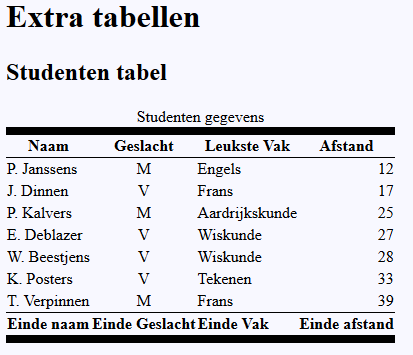

# Oefenreeks 02 Werken met tabellen
## Oefening B
### OPGAVE/ STAPPEN
* Werk verder op de uitwerking van oefening 02 A als uitgangspunt voor je uitwerking.

Voer volgende stappen uit met een editor naar keuze.

* Voeg de pagina *tabellen.html* toe aan je uitwerking van oefening A.
* Koppel de reeds bestaande *stylesheet* aan deze pagina.
* Voeg op deze pagina ook de html syntax toe om het tabblad van de pagina te voorzien van een icon.
* Tracht op basis van onderstaande afbeelding de tabel op te maken met CSS. 
  * Maak gebruik van de elementen ***thead***, ***tbody*** en ***tfoot*** om je CSS *selectors* te schrijven.
  * Tip, de vette lijnen zijn *8 pixels* dik.

#### Voorbeeld uitwerking
